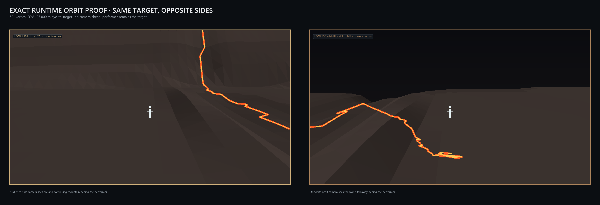
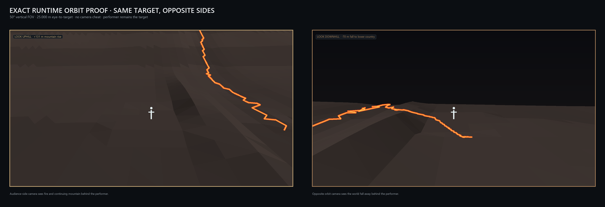
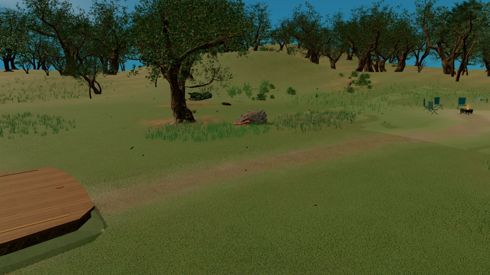
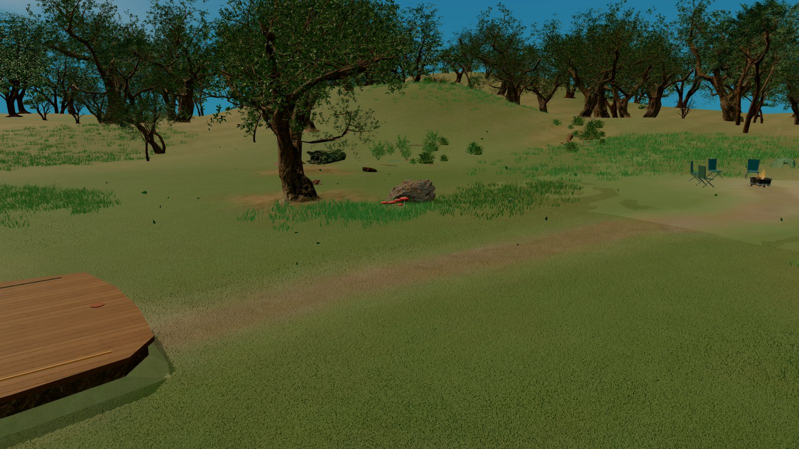
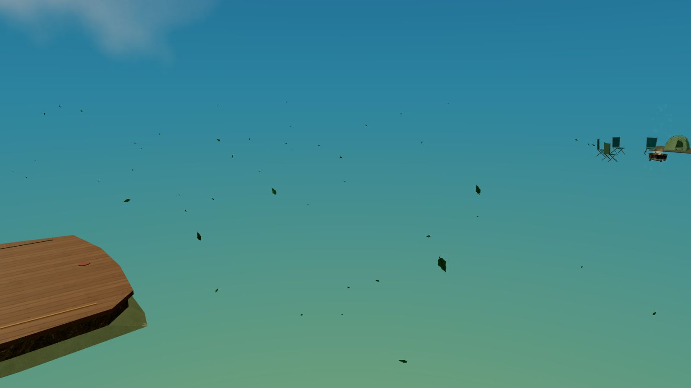

# Scene-design examples

Supporting evidence for the [shared brief](../architecture/scene-design-brief.md).
Images below were opened and inspected on 2026-09-05 from repository revision
`1c90c9de64`. They are historical artifacts, not captures of today's live scenes.
Acceptance applies only to the named design stage. Transfer the lesson rather
than the scene's colors, dimensions, or required density.

## Ember: a performance patch within a continuous flank

**Recorded rejection:** Gate 2 R4 passed its geometry checks, but Austen rejected
the broad ledge. **Recorded approval:** Gate 1.1 and Gate 2 R5 placed the smaller
irregular performance patch within the inclined flank. The source identifies
the rejection and approval tracker records; this is spatial approval, not a
final materials or runtime-quality endorsement.

| R4 geometry, later rejected at Gate 2                                                                                                                                                                     | R5 geometry, approved at Gate 1.1 and Gate 2                                                                                                                                                                              |
| --------------------------------------------------------------------------------------------------------------------------------------------------------------------------------------------------------- | ------------------------------------------------------------------------------------------------------------------------------------------------------------------------------------------------------------------------- |
|  |  |

These are diagnostic geometry proofs using the documented common orbit and
lens, not beauty renders. Compare the relationship between the performer and
the surrounding incline from both sides. R5's [oblique graybox view](../superpowers/specs/ember-spatial-directions/evidence/gate-2-geology-graybox-r5/13-midflank-oblique.png)
adds audience and contact context.

**Transfer:** technical clearance can pass while the performance area still
feels detached from its setting. Test the spatial relationship before polish.
Do not copy Ember's exact action radius into another scene.

Source: [Ember scene-development record](../superpowers/specs/ember-spatial-directions/scene-development.md),
sections “Historical Mid-Flank Fire Pilgrimage Gate 2 R4” and “Mid-Flank Fire
Pilgrimage Gate 2 R5.”

## Forest: grouping matters more than a plant count

The August 13 [meadow verdict](../superpowers/specs/moonlit-firefly-forest/evidence/meadow-believability-r2/forest-meadow-believability-verdict.md)
records rejection of evenly spaced ribbons with weak root contact and acceptance
of clustered colonies with several plant forms.

| Recorded rejected floor                                                                                                                                                                           | Observed R3 floor revision                                                                                                                                                                 |
| ------------------------------------------------------------------------------------------------------------------------------------------------------------------------------------------------- | ------------------------------------------------------------------------------------------------------------------------------------------------------------------------------------------ |
|  |  |

The second frame illustrates the revised grouping at a comparable view. It is
not independently established as the final approved capture. The scene still
has its own later material and path revisions.

**Transfer:** assess the middle scale between surface texture and large objects.
Clustering, contact, and silhouette variety matter independently of density.
This does not prescribe grass coverage for other environments.

### A written verdict can point to an invalid proof image

The same verdict calls `final-day-floor.png` an accepted floor image. Inspection
of that file instead shows sky-colored space where the terrain and trees should
be, with the stage, chairs, and loose leaves still visible:

**Observed evidence limitation:** this frame cannot demonstrate a finished
floor. It does not establish why the environment was absent or whether the live
scene was broken. Preserve the source record, flag the discrepancy, and obtain
valid current proof before relying on it. Never infer readiness from a filename.

## Further recurring evidence

| Design check                                          | Source and scope                                                                                                                                                                                                                                         |
| ----------------------------------------------------- | -------------------------------------------------------------------------------------------------------------------------------------------------------------------------------------------------------------------------------------------------------- |
| World continuity across supported cameras             | [Autumn horizon contract](../specs/2026-09-01-autumn-horizon-continuity.md); [Ocean boundary decision](../superpowers/specs/active/2026-08-09-fathom-ocean-world-boundary-design.md). Ocean's underwater camera limit is a scene-specific user decision. |
| Compatible assets and believable ground contact       | [Autumn cohesion and root-contact corrections](../superpowers/specs/2026-08-09-autumn-asset-cohesion-plan.md). Preserve material differences while joining assets to the same site.                                                                      |
| Source silhouette before lighting                     | [Winter design](../superpowers/specs/active/2026-08-08-moonlit-winter-hollow-design.md). Scaled saplings and primitive logs failed at close range.                                                                                                       |
| Placement and export validity before counting success | [Blossom September 5 handoff](../superpowers/specs/2026-09-05-blossom-hanami-redesign-handoff.md). A successful authoring build had not yet become the updated, visually reviewed runtime.                                                               |
