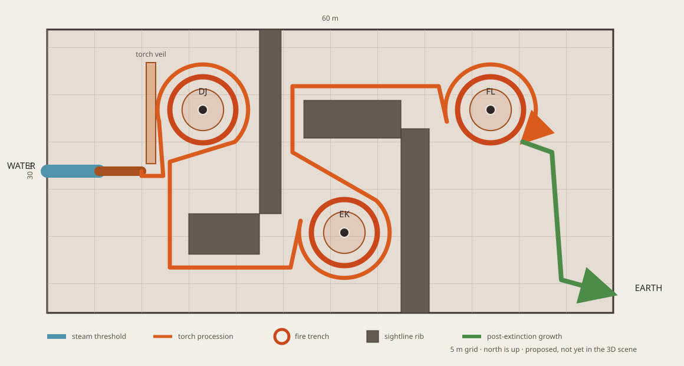

# The First Fire: Torch Procession Redesign

Approved by Austen on 2026-08-06: "I'm in, lock it."

This document supersedes the August 4 amphitheater design. It governs the next
Fire-room implementation. Austen authorized the floor plan, pure spatial
contract, state contract, proof tests, and 3D handoff on 2026-08-06. That
authorization does not include production scene integration or visual effects.

## The room in one paragraph

The visitor leaves Water through a low steam passage where droplets hiss on hot
basalt, crosses a short ember bridge, and enters a field of rough ground
torches. Fire draws a single route through what feels like a maze. The route
reaches three isolated shrine habitats for the existing DJ, EK, and FL
performers. At each shrine, the visitor follows a horseshoe path around a narrow
fire trench while perimeter torches ignite behind their steps. Completing the
orbit opens the next passage; tall flames collapse into low coals, but the
automaton keeps moving. After FL, every red flame and coal in the room goes out.
From the hidden Earth gully, moss spreads through cracks in the cooled basalt,
reaches the visitor, circles the final trench in green, and leaves a living path
into Earth.

## Canon change

Tracker decision `jl8TveF5GrOgHsA2Vyfr` makes Fire the explicit exception to
the August 2 one-automaton-per-elemental-chamber rule.

- Water, Earth, Air, Sun, and Moon keep one solo automaton each.
- Fire has three automatons because its three split-opposite compound pairs are
  separate encounters.
- The three Fire performers never share a performance sightline or acoustic
  field. They remain solo exhibits, not an ensemble.
- Each performer occupies a recessed shrine habitat. A shared stage or three
  adjacent bays would violate this design.

This exception does not reopen performer counts elsewhere in the cave.

## Experience sequence

```text
Drowned Gallery
    |
steam threshold: dripping water, hiss, rising vapor
    |
short ember bridge
    |
torch field and implied maze
    |
DJ shrine orbit
    | tall fire collapses to low coals
EK shrine orbit
    | tall fire collapses to low coals
FL shrine orbit
    |
all red extinguishes
    |
moss reaches the visitor and completes a green ring
    |
Earth gully, then the hidden canyon reveal
```

The maze is not a pathfinding puzzle. It creates the pressure and scale of fire
walls without asking the visitor to solve dead ends. Flame density and height
always make the forward route legible.

## Entrance: Water becomes heat

Fire begins before the first visible flame.

- Water continues to drip from the Drowned Gallery into a low basalt passage.
- Drops strike hot stone and produce localized hissing and steam.
- The passage dries as it approaches the ember bridge.
- The bridge is a short threshold, not the room's main event.
- The first large reveal is the torch field beyond the bridge.

The transition should feel physical. A colored fog volume by itself does not
satisfy it.

## The torch field

The field uses charred rough-hewn staves, split timber, and stone fire sockets
at varied heights. Nothing reads as imperial architecture, a metal torch stand,
or a literal Fire Nation set. That reference contributes procession, discipline,
and scale only.

The field has three jobs:

1. Hide each shrine until its encounter.
2. Draw the visitor forward without signs or objective markers.
3. Remember progress by collapsing completed walls into ankle-high coals.

Physical stems remain in place. The maze changes through flame height, light,
smoke, and sound. It does not depend on destructible walls.

Completed areas remain walkable and backtracking remains possible. Fire never
closes behind the visitor as a hard trap.

## Shrine circulation

Each shrine is a small habitat with a central performer, a narrow fire trench,
and a visitor path wrapping about 240 degrees around it. The entry and exit sit
on different sides, so ordinary forward movement completes the interaction.

Interaction rules:

- No button prompt.
- No requirement to wait through a full sequence loop.
- No exact full-circle requirement.
- No single trigger that can be missed and strand the visitor.
- Perimeter torches ignite in generous overlapping zones as the visitor moves.
- The exit fire curtain begins yielding as the final path segment activates.
- The performer continues moving after the shrine flames collapse.

The fire trench preserves the public/exhibit boundary while allowing the
visitor to get close and inspect the performer from several angles.

## Three fire grammars

The shrines share one prehistoric material language. Their flame behavior makes
the three pairs distinct.

| Shrine | Domain basis                     | Environmental fire target                                               |
| ------ | -------------------------------- | ----------------------------------------------------------------------- |
| DJ     | pro/pro compound pair            | Broad continuous sweeps and smooth circular fire bands                  |
| EK     | anti/anti compound pair          | A tighter inward-curling crown with petal-like negative space           |
| FL     | blue anti, red pro compound pair | An asymmetric divided fire grammar with two visibly different behaviors |

Domain facts were rechecked through the Flow Arts Knowledge MCP on 2026-08-06.
The existing `cave-fire-seq-dj`, `cave-fire-seq-ek`, and
`cave-fire-seq-fl` data remain the Fire roster unless a later domain review
explicitly changes them.

The room never labels these associations. Visitors should feel that the
shrines behave differently before they understand why.

## Progress and room state

The forward experience is monotonic:

```text
approach
  -> dj-active -> dj-complete
  -> ek-active -> ek-complete
  -> fl-active -> fire-extinguished
  -> growth-complete
```

Expected state behavior:

- Tall flame walls become low coals when their shrine completes.
- Completed automaton playback continues.
- Before the finale, low coals preserve route history and floor visibility.
- The FL completion extinguishes every remaining red source, including coals
  and prop flames.
- Neutral floor visibility remains during blackout. Blackout cannot make the
  walk unsafe.
- Completion persists while the current museum session is active.
- Re-entering from Earth during the same session shows the extinguished room
  and completed green ring.
- A new museum run resets the procession.

The implementation may use a dedicated room-state coordinator. Do not scatter
progress booleans across geometry, scene, and performer components.

## Fire extinguishing and Earth growth

After the FL orbit, the final shrine gets one last environmental flare. On the
next beat, every red source disappears. The intended sequence is:

1. Complete removal of flame and coal light.
2. One breath of near-silence with safe neutral floor visibility.
3. Smoke begins pulling toward the Earth passage.
4. Daylight catches wet moss inside the existing gully mouth.
5. Two or three thin growth lines advance through cracks toward the visitor.
6. The growth reaches the final trench, splits, and completes a green circle.
7. One branch remains connected to the Earth gully and becomes the route cue.

Red and green do not overlap. The room must release its fire before Earth
answers.

Growth stays limited to the final shrine and transition path. It does not cover
the torch field or reclaim the whole room. Small leaves and moss can unfold;
instant room-wide grass would turn the moment into an unrelated magic spell.

The existing Earth gully bend remains valuable because it hides the canyon
until the visitor follows the green path around the corner.

## Performer and environmental timing

The environment needs a shared timing signal for the active shrine. Exact
implementation is deferred, but the contract is clear:

- Shrine fire can read the active performer's step index and within-step
  progress.
- Environmental flares respond to that local performer only.
- The three performers are not synchronized into an ensemble.
- A completed shrine can reduce its effects without pausing its performer.
- The final extinction is a room-state event, not an animation ownership hack.

## Light and rendering budget

Most torches must be inexpensive repeated scenery, not independent hero
simulations.

- Instance repeated torch stems and repeated flame cards where practical.
- Use emissive geometry and limited pooled lights for the wider field.
- Reserve detailed fire, smoke, and stronger local lighting for the active
  shrine.
- Avoid a shadow-casting point light per torch. Three.js renders a point-light
  shadow from six directions, making that pattern unsuitable for a dense field.
- Bound and pause effects outside the active room and shrine lifecycle.
- Measure the room in the merged museum, not on an isolated test route.

Primary references:

- [Three.js InstancedMesh](https://threejs.org/docs/pages/InstancedMesh.html)
- [Three.js shadow performance](https://threejs.org/manual/en/shadows.html)
- [Threlte useTask](https://threlte.xyz/docs/reference/core/use-task)

## Audio plan

Audio carries state as strongly as color.

- Entry: sparse water drops, hot-stone hiss, low steam pressure.
- Torch field: many small flame sources forming one broad bed.
- Active shrine: one close performer, trench roar, and locally dominant prop
  movement.
- Completed shrine: flame roar falls to coal ticks while prop movement remains.
- Final extinction: a single pressure release, then one breath of near-silence.
- Growth: air through the gully, damp stone, leaves, and Earth ambience replacing
  the fire bed.

Rock ribs and distance must prevent simultaneous performer audio from reading
as a group performance.

## Geometry requirements

The current approximate 26 by 20 metre amphitheater program is superseded. Do
not force the new design into those dimensions.

The replacement layout must:

- Derive from compiled room and door bounds, with no absolute world positions.
- Fit three shrine habitats, each with a 240-degree visitor orbit.
- Block every pair of performer sightlines from the visitor route.
- Preserve a continuous Water-to-Fire-to-Earth route.
- Keep fire trenches and performer habitats physically unreachable.
- Preserve safe backtracking after each state transition.
- Meet the existing terrain contract: rendered geometry, elevation, blocking,
  performer anchors, and tests read from one geometry source.
- Resize `cave-fire` if the required habitat and sightline clearances do not fit.

The graybox determines the final dimensions. Room expansion is expected but no
number is approved until the derived layout proves circulation and sightlines.

## Measured floor plan groundwork

The preliminary plan proves that the approved experience needs a 60 by 30 metre
clear interior. The current compiled Fire room is 46.5 by 20.5 metres. A focused
test makes that mismatch explicit instead of letting a 3D pass squeeze the new
program into the old amphitheater shell.



The plan uses a north-south-north S-turn:

| Element               |          Room-local centre or span | Measured contract                              |
| --------------------- | ---------------------------------: | ---------------------------------------------- |
| Water steam threshold |             west door to x = 5.5 m | 4 m clear width                                |
| Ember bridge          |                       x = 5.5–10 m | 3 m clear width                                |
| DJ shrine             |                      (16.5, 8.5) m | 2.2 m habitat, 3.5 m outer trench, 4.8 m orbit |
| EK shrine             |                     (31.5, 21.5) m | mirrored 240-degree orbit                      |
| FL shrine             |                        (47, 8.5) m | 240-degree orbit, then Earth release           |
| Earth growth path     | FL exit to south-aligned east door | 3 m clear width                                |

Alternating rock ribs descend from opposite cave walls. Each transfer makes a
blind turn before the next performer appears. At 0.2 m visitor sampling, no
point on the route can see two performer anchors. Performer-to-performer lines
also intersect authored rock.

The orbit path is 2.4 m wide. Four 75-degree activation zones advance every 55
degrees, giving adjacent zones 20 degrees of overlap. Reaching a later zone
implicitly satisfies earlier zones, so one missed boundary event cannot strand
the visitor.

The measured plan is encoded in
`src/lib/features/museum/data/first-fire-procession-plan.ts`. The room authoring
minimum is 80 by 40 units, which the existing room builder compiles to 60 by 30
metres. The production floor plan does not adopt that size yet because its live
Fire renderer is part of another session's uncommitted work.

## Preliminary implementation package

The 3D pass inherits these verified artifacts:

- `first-fire-procession-plan.ts`: room-relative shrines, trenches, 240-degree
  orbits, route sections, rock occluders, torch budget, sightline math, and a
  compiled-grid integration entry point.
- `first-fire-procession-state.ts`: monotonic DJ → EK → FL → extinction →
  growth state with idempotent, overlap-tolerant trigger handling.
- `first-fire-procession-plan.test.ts`: dimensions, route continuity,
  circulation clearance, shrine separation, sightlines, activation overlap,
  roster, and resize proof.
- `first-fire-procession-state.test.ts`: order, monotonicity, repeated triggers,
  future-shrine rejection, session persistence, and new-run reset.
- `2026-08-06-first-fire-torch-procession-floor-plan.svg`: the review drawing,
  marked and tested against the same measured coordinate contract.

The 3D implementation should extend existing patterns instead of opening new
rendering systems:

- Extend the pure geometry contract used by `first-fire-layout.ts` and
  `drowned-gallery-terrain.ts`.
- Reuse tracked `FireRenderer3D` for the three performers' moving prop flames.
  It is a moving-tip particle system, not the static torch field renderer.
- Follow `museum-kit-glb.ts` for static `InstancedMesh` placement of repeated
  stems and low-cost flame cards.
- Reuse the museum room-light pool after its overlapping edit lands. Do not
  hard-code its current capacity into Fire.
- Do not depend on the currently untracked shared particle-pool work until its
  owning session lands it.

The static budget is 72 field stems plus 18 perimeter stems per shrine, 126
stems total. Only one shrine may use detailed fire at a time.

## Implementation scope

Expected ownership, after implementation approval:

- `src/lib/features/museum/data/first-fire-layout.ts`: replace the amphitheater
  program with the procession, shrine cells, orbits, trenches, and probes.
- `src/lib/features/museum/components/game/FirstFireGraybox.svelte`: render the
  torch field, shrine states, coals, blackout, and transition cues.
- `src/lib/features/museum/data/vulcan-cave-floor-plan.ts`: resize the Fire room
  if needed and derive three station anchors from the new layout.
- `src/lib/features/museum/components/game/MuseumPerformerStation3D.svelte` or a
  new narrow timing adapter: expose local performer timing without coupling the
  whole room to performer internals.
- `src/lib/features/museum/components/game/Museum3DScene.svelte` or a dedicated
  Fire coordinator: own session-scoped room progress and lifecycle wiring.
- `src/lib/features/museum/components/game/EarthCanyonGraybox.svelte`: connect
  the existing green gully to the final growth event without changing Earth's
  larger reveal.
- `tests/unit/museum/first-fire-terrain.test.ts` and
  `first-fire-traversal.test.ts`: replace amphitheater assumptions with the new
  geometry and state invariants.
- `tests/unit/museum/museum-walk.test.ts`: prove the resized room remains part of
  the connected museum.

The existing Fire sequence data should not change during a spatial redesign.

## Implementation order

1. Wait for the overlapping museum edits listed below to clear.
2. Build the new pure layout and state model with terrain and traversal tests.
3. Graybox the steam threshold, torch maze, shrine orbits, and low-coal states.
4. Add local performer timing and the final blackout.
5. Add bounded fire effects, smoke behavior, growth, and audio.
6. Tune lighting, sightlines, pacing, and performance in the merged museum.
7. Run the full verification gate before claiming the room is complete.

## Current implementation gate

At approval time, these implementation targets have uncommitted edits from
other sessions:

- `FirstFireGraybox.svelte`
- `EarthCanyonGraybox.svelte`
- `Museum3DScene.svelte`
- `MuseumPerformerStation3D.svelte`
- museum lifecycle and streaming services

Do not overwrite, revert, or route around those changes. Stay on `main`; no
branch or worktree is authorized. Recheck the exact overlap before coding.

## Risks and controls

| Risk                                                    | Control                                                                             |
| ------------------------------------------------------- | ----------------------------------------------------------------------------------- |
| Three shrines make Fire feel like three unrelated rooms | One material language, compact shrine cells, distinct flame grammar only            |
| The maze confuses or traps visitors                     | One authored route, no dead ends, no hard closure behind the player                 |
| Dense fire destroys frame time                          | Instanced scenery, pooled lights, one detailed active shrine, measured budgets      |
| Blackout makes the floor unsafe                         | Preserve non-red neutral floor visibility and test from first person                |
| Growth reads as arbitrary magic                         | Keep it crack-bound, sourced from Earth, and limited to the final shrine and tunnel |
| Room state breaks on streaming or backtracking          | One coordinator, session-scoped state tests, re-entry verification                  |
| Three performers read as an ensemble                    | Rock ribs, isolated audio, no shared sightline, no global choreography sync         |

## Verification gate

No "done" claim is allowed without all of the following evidence:

### Automated

- Terrain coverage has no uncovered walkable point inside the Fire bay.
- Water and Earth door bands remain covered and reachable.
- Every neighbor elevation step on the route is at or below the camera
  controller threshold.
- All three shrine orbits are connected and cannot enter their fire trenches.
- Performer anchors match the layout's shrine anchors.
- Sampled visitor positions cannot see two performer anchors through the
  authored sightline blockers.
- Shrine state transitions are monotonic and tolerant of overlapping triggers.
- Backtracking works before and after the final extinction.
- Session re-entry preserves extinction and growth; a new run resets them.
- The museum walk flood test still reaches every room.
- Museum unit tests and `svelte-check` pass.

### Runtime

- No console errors during a complete Fire-room traversal.
- Draw calls, active lights, and frame time are measured in the merged museum.
- The floor remains readable during the no-red interval.
- Fire state is restored correctly after leaving for Earth and returning.
- Visual frames prove the entrance, each shrine, low-coal history, blackout,
  green ring, and Earth cue at the required desktop and mobile viewports.

### Human gate

Austen walks the room first-person and confirms:

- Steam makes Water-to-Fire legible before the first flame.
- The maze feels dangerous without becoming confusing.
- Each shrine feels separate and worth approaching.
- The horseshoe interaction requires no explanation.
- The blackout reads as release, not a broken scene.
- The green ring draws attention toward Earth without spending Earth's canyon
  reveal early.
