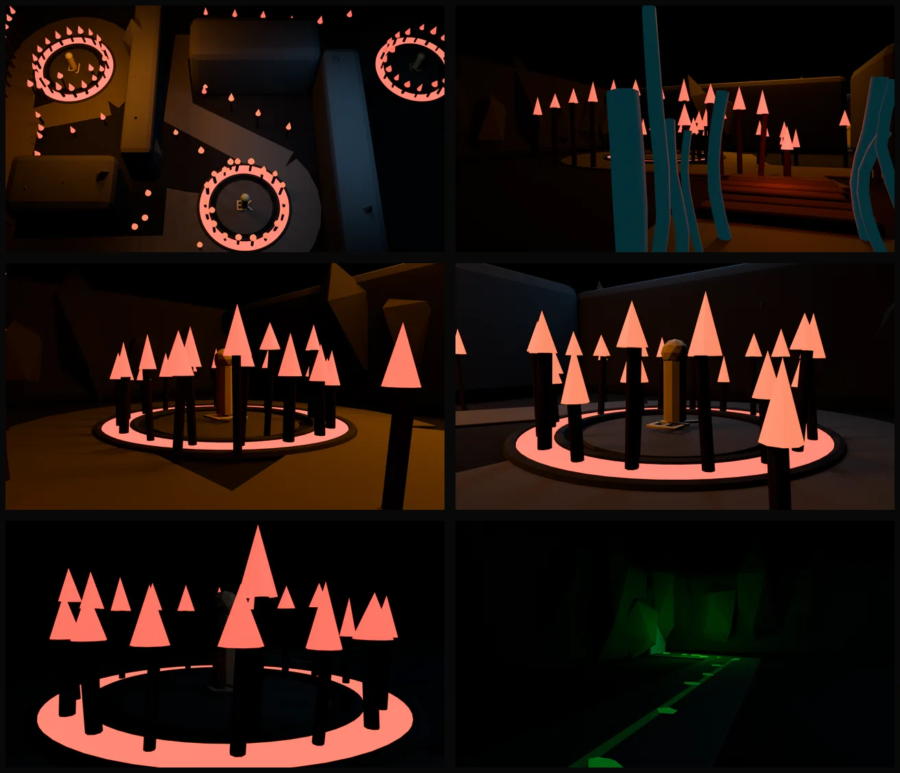

# First Fire Torch Procession: 3D Handoff (2026-08-06)

## Status at a glance

The creative design, measured floor plan, interaction state, Blender coordinate
bridge, standalone Blender graybox, optimized review GLB, floor-plan review,
isolated first-person walk route, and a runtime fire review pass now exist.
Production museum integration has not started.

The graybox is intentionally isolated from the live cave. It proves scale,
route pacing, shrine separation, full-height sightline blockers, torch density,
and the Fire-to-Earth state contrast without overwriting another session's
museum work.



The contact sheet is ordered as overview, Water threshold, DJ, EK, FL, and the
Earth route after complete red extinction. The flame cones and performer posts
are spatial guides, not final art.

## Mission

Replace the current First Fire amphitheater with the approved Torch Procession:
a steam threshold from Water, a short ember bridge, three isolated DJ, EK, and
FL shrine habitats, total red extinction, then a bounded green route into
Earth. The governing design is the
[Torch Procession spec](./2026-08-06-first-fire-torch-procession-design.md).

Tracker decision `jl8TveF5GrOgHsA2Vyfr` is accepted and completed. Fire is the
sole three-performer cave exception. The three performers remain solo exhibits
and may never share a performance sightline or acoustic field.

## Review surfaces

- Interactive measured plan:
  `https://localhost:5173/test/first-fire-floor-plan`
- Walkable Blender graybox:
  `https://localhost:5173/test/first-fire-graybox`
- Route source:
  `src/routes/test/first-fire-floor-plan/`
- Walk route source:
  `src/routes/test/first-fire-graybox/`
- The walk route carries a local `+layout@.svelte` reset. Keep it. The product
  app shell treats bare `/test/*` paths as invalid module URLs and rewrites them
  to Create.
- Static measured drawing:
  `2026-08-06-first-fire-torch-procession-floor-plan.svg`
- Blender review contact sheet:
  `2026-08-06-first-fire-graybox-review.webp`
- Editable generated Blender scene:
  `blender/first-fire-torch-procession-graybox.blend`
- Optimized review GLB:
  `static/models/museum/cave/first-fire-torch-procession-graybox.glb`

Austen reviewed the interactive floor-plan page on 2026-08-06 and said, "It's
great." The standalone walk route loads the optimized Blender GLB and uses the
shared Unified Camera Controller with Rapier collision derived from the same
coordinate contract. After walking the Blender route, Austen called it "way
better than the other grayboxes." It remains isolated from the live museum.

## Sources of truth

| Concern                              | Authority                                          |
| ------------------------------------ | -------------------------------------------------- |
| Creative sequence and acceptance     | `2026-08-06-first-fire-torch-procession-design.md` |
| Room-relative measured geometry      | `first-fire-procession-plan.ts`                    |
| DJ to EK to FL room progression      | `first-fire-procession-state.ts`                   |
| Blender axis and origin transform    | `first-fire-blender-contract.ts`                   |
| Generated artist manifest            | `2026-08-06-first-fire-blender-plan.json`          |
| Reproducible Blender scene authoring | `scripts/build-first-fire-graybox.py`              |
| Runtime collision and triggers       | TypeScript plan and terrain contracts, not the GLB |

Never hand-edit the generated JSON. Regenerate it from the TypeScript plan. The
manifest and Blender scene both carry this source digest:

`e674f006c4d133d28bf894c1b912560611cfe66edca1362a849d805d01f38f14`

## Blender coordinate contract

The museum mounts authored room GLBs at the compiled room centre with rotation
`[0, 0, 0]` and scale `1`. The nominal Fire interior is 60 by 30 metres, so the
plan centre is `(30, 15)`.

The authored transform is:

```text
Blender X = plan X - 30
Blender Y = 15 - plan Z
Blender Z = elevation
```

Blender's glTF export then maps Blender `(X, Y, Z)` to runtime `(X, Z, -Y)`.
This returns the authored points to the runtime room-relative X/Z frame after
the GLB is mounted at the room centre.

| Anchor       |       Plan X/Z |     Blender X/Y/Z |
| ------------ | -------------: | ----------------: |
| Water door   |      `(0, 15)` |     `(-30, 0, 0)` |
| DJ performer |  `(16.5, 8.5)` | `(-13.5, 6.5, 0)` |
| EK performer | `(31.5, 21.5)` |  `(1.5, -6.5, 0)` |
| FL performer |    `(47, 8.5)` |    `(17, 6.5, 0)` |
| Earth door   |     `(60, 28)` |    `(30, -13, 0)` |

`first-fire-blender-contract.test.ts` proves the inverse transform at twelve
decimal places across every route point. It also locks the door and performer
anchors, centred room bounds, collection names, and generated manifest digest.

## Blender collection and export contract

| Collection     | Owner and purpose                                                | Ships in `FF_` GLB |
| -------------- | ---------------------------------------------------------------- | ------------------ |
| `SHELL`        | Cave floor, perimeter, steam guides, route surfaces, Earth crack | Yes                |
| `ROCK_RIBS`    | Full-height sightline blockers and return baffles                | Yes                |
| `SHRINES`      | Three recessed habitat foundations                               | Yes                |
| `TRENCHES`     | Fire trench rims and magma placeholders                          | Yes                |
| `BRIDGE`       | Ember bed and uneven basalt crossing slabs                       | Yes                |
| `TORCH_GUIDES` | 72 field stems plus 18 stems per shrine                          | Yes                |
| `REFERENCE`    | Eye-height samples and blocked sightline rays                    | No                 |
| `LOCATORS`     | Water/Earth doors and performer stand-ins                        | No                 |
| `QA_ONLY`      | Seven cameras, review lights, and labels                         | No                 |

Only mesh objects beginning with `FF_` are exported. The optimized GLB contains
zero cameras and zero lights. Performer locators are deliberately excluded so
the runtime automatons remain authoritative.

The 126 stems share one mesh. The three flame guide families share three more.
The optimized GLB uses four `EXT_mesh_gpu_instancing` nodes with instance counts
of 126, 50, 38, and 38.

The walk route replaces the 126 static cone guides at load time. It reads the
optimized GLB's instance matrices, hides the cone batches, and feeds the same
positions and scales into the runtime fire pass. Do not copy torch coordinates
into another runtime list. The GLB remains the spatial authority for the review
effect.

## Rebuild from source

Run these commands from the repository root in PowerShell:

```powershell
pnpm exec tsx scripts/export-first-fire-blender-plan.ts

& "C:\Program Files\Blender Foundation\Blender 5.0\blender.exe" --background --factory-startup --python scripts/build-first-fire-graybox.py

& "C:\Program Files\Blender Foundation\Blender 5.0\blender.exe" --background blender/first-fire-torch-procession-graybox.blend --python scripts/blender-export-glb.py -- --include FF_ --output artifacts/first-fire-graybox_raw.glb

node scripts/optimize-first-fire-graybox-glb.mjs

node scripts/verify-first-fire-graybox-glb.mjs
```

The Blender build uses `--factory-startup`. It does not touch the live Blender
scene, which currently contains another session's Autumn work.

The repository ignores `blender/` by policy because editable Blender files are
large local build products. `scripts/build-first-fire-graybox.py` is the tracked
editable source and regenerates the `.blend` deterministically from the checked
in manifest. The optimized GLB is the tracked review artifact.

## Verified evidence

### Spatial and state package

- Groundwork commit `994bb600be` contains the design, measured plan, state
  model, floor-plan SVG, and original focused regression package.
- The existing five-file regression command passed 59 tests at groundwork
  handoff time.
- The interactive review route consumes the same measured plan directly.
- The current production Fire shell still rejects the plan at 46.5 by 20.5
  metres. This is the intentional resize proof.

### Coordinate bridge

- Manifest generation completed with SHA-256 digest
  `e674f006c4d133d28bf894c1b912560611cfe66edca1362a849d805d01f38f14`.
- Focused coordinate and floor-plan suites pass after regeneration.
- Water is at Blender X = -30, Earth is at X = 30, and the three performer
  anchors match the measured plan.

### Blender graybox

- Blender 5.0.1 completed the headless build.
- Exact room footprint: 60 by 30 metres.
- Export meshes before instancing: 409.
- Field torch stems: 72.
- Perimeter torch stems: 54.
- Required collections: 9 of 9.
- Review renders: plan, overview, threshold, DJ, EK, FL, and Earth.
- Fire-state renders hide green growth.
- The Earth-state render hides all flame guides, magma, bridge embers, and red
  review lights before showing the green crack.

The machine-readable build report is regenerated at
`artifacts/first-fire-graybox-report.json`.

### Optimized GLB

- File size: 188,232 bytes.
- Scene count: 1.
- Node count: 161.
- Mesh count after GPU instancing: 155.
- Material count: 15.
- Cameras: 0.
- Lights: 0.
- `gltf-transform validate`: no errors and no warnings.
- Extensions: `EXT_mesh_gpu_instancing`, `KHR_draco_mesh_compression`, and
  `KHR_materials_emissive_strength`.

The validator reports informational notes for extensions it cannot inspect and
pruned intermediate buffer data. It reports no error or warning severity.

### Runtime fire review pass

- All 126 flame transforms are recovered from the three optimized
  `EXT_mesh_gpu_instancing` guide batches at runtime.
- The torch field renders as one instanced batch. Each flame contains a broken
  main body, two independently moving tongues, and a soft outer volume instead
  of the original cone silhouette.
- Six pooled, non-shadowing point lights carry local fire color through the
  procession without creating 126 dynamic lights.
- DJ, EK, and FL each receive one independently flickering point light with a
  frozen 512-pixel cube shadow. Static Blender meshes cast and receive those
  shadows.
- Each shrine also uses the shipped `VolumetricFireMesh` at medium quality for
  a raymarched performer-scale fire volume. The torch field remains the cheaper
  instanced effect.
- `prefers-reduced-motion` slows both fire systems instead of removing the
  spatial cue.
- Focused flame-anchor, batch, and collision verification passes 6 tests.
- Full `svelte-check` reports 0 errors and 0 warnings.
- Live inspection confirms 126 runtime flames, visible local illumination,
  shrine shadows, and no WebGL shader errors. The only console warning is the
  pre-existing Rapier initialization deprecation.

## Runtime ownership boundary

The review GLB is static visual geometry. It does not own collision, orbit
triggers, progression, performer anchors, extinction, or session persistence.

- Collision and walkability must continue to come from the TypeScript terrain
  contract.
- `first-fire-procession-state.ts` owns monotonic DJ, EK, FL, extinction, and
  growth progression.
- Runtime performer timing remains local to each shrine.
- Final fire, smoke, steam, coals, and growth are dynamic runtime effects.
- Placeholder flame cones, magma surfaces, and the green guide may be hidden or
  removed when their runtime replacements land.

`Museum3DScene.svelte` already mounts `roomPresentation.modelPath` at a room's
compiled centre through `GltfAsset.svelte`. That loader supports Draco,
Meshopt, and KTX2. Do not wire this GLB there until two conditions are met:

1. The current overlapping museum edits have landed.
2. Authored room GLBs are gated by the room lifecycle, or the Fire asset is
   explicitly accepted as always resident. The current authored-room loop is
   not obviously streamed by `RoomLifecycleManager`.

## Production integration gate

The previously overlapping live museum files were clean when this handoff was
updated. The runtime fire pass still belongs only to the review route. Before
production integration, re-check these files for concurrent work:

- `FirstFireGraybox.svelte`
- `EarthCanyonGraybox.svelte`
- `Museum3DScene.svelte`
- `MuseumPerformerStation3D.svelte`
- `museum-room-light-pool.ts`
- `room-lifecycle-manager.ts`

Stay on `main`. Do not overwrite or revert concurrent changes. No branch or
worktree is authorized.

## Next owner: start here

1. Open `blender/first-fire-torch-procession-graybox.blend` and inspect the
   collection structure, review cameras, door locators, performer locators, and
   sightline rays.
2. Walk the review mentally in this order: Water threshold, bridge, first torch
   reveal, DJ orbit, blind transfer, EK orbit, blind transfer, FL orbit,
   extinction, Earth crack.
3. Preserve every measured anchor and full-height blocker while replacing
   graybox forms with final cave geometry.
4. Replace rectangular rib cores with credible cave mass. Do not reduce their
   height or open performer-to-performer views.
5. Keep Meshy limited to replaceable modules such as torch stems, basalt hero
   ribs, bridge stones, or shrine artifacts. Do not generate the whole cave as
   one asset.
6. Re-run the builder and coordinate tests whenever plan geometry changes.
7. Integrate into the museum only after the overlap gate clears.

## Remaining production order

1. Resize `cave-fire` in `vulcan-cave-floor-plan.ts` to the approved authoring
   minimum and re-run the whole museum walk because downstream rooms move.
2. Replace `first-fire-layout.ts` amphitheater assumptions with terrain,
   trenches, blockers, route probes, and three performer anchors derived from
   the procession plan.
3. Decide whether the final GLB replaces or dresses the tile shell. Collision
   remains plan-driven either way.
4. Mount the authored scene behind room lifecycle gating.
5. Add one room-scoped progression coordinator.
6. Add bounded fire, steam, smoke, coal, blackout, growth, and audio effects.
7. Connect Earth's existing bent gully without exposing the canyon early.
8. Run terrain, sightline, traversal, museum walk, typecheck, console, visual,
   draw-call, light-count, and frame-time verification.
9. Austen walks the merged room first-person before final art is accepted.

## Decisions that must not drift

- The order is Water steam threshold, ember bridge, DJ, EK, FL, total red
  extinction, green response, then Earth.
- The maze creates pressure without dead ends or traps.
- Each shrine has a 240-degree visitor orbit outside a narrow fire trench.
- DJ, EK, and FL never share a performance sightline or acoustic field.
- Completed tall flames collapse to low coals while the performer keeps moving.
- FL extinguishes every red source before any green appears.
- Green comes from Earth's existing gully and remains bounded to the final
  shrine and exit route.
- Backtracking remains possible.
- The graybox is a measured production scaffold, not the final art target.

## Known limitations

- The room has not been walked first-person in the merged museum.
- Steam, magma, extinction, coals, and growth are still visual stand-ins. The
  runtime flame pass proves appearance and lighting, not progression wiring.
- The performer locators prove scale and placement, not animation or prop
  clearance.
- Audio isolation has not been measured.
- The light count is bounded and the flame field is instanced. Foreground frame
  time still needs measurement in the production museum shell.
- The final cave ceiling and vertical silhouette need an artist pass.
- The optimized GLB is not yet referenced by production room data.
