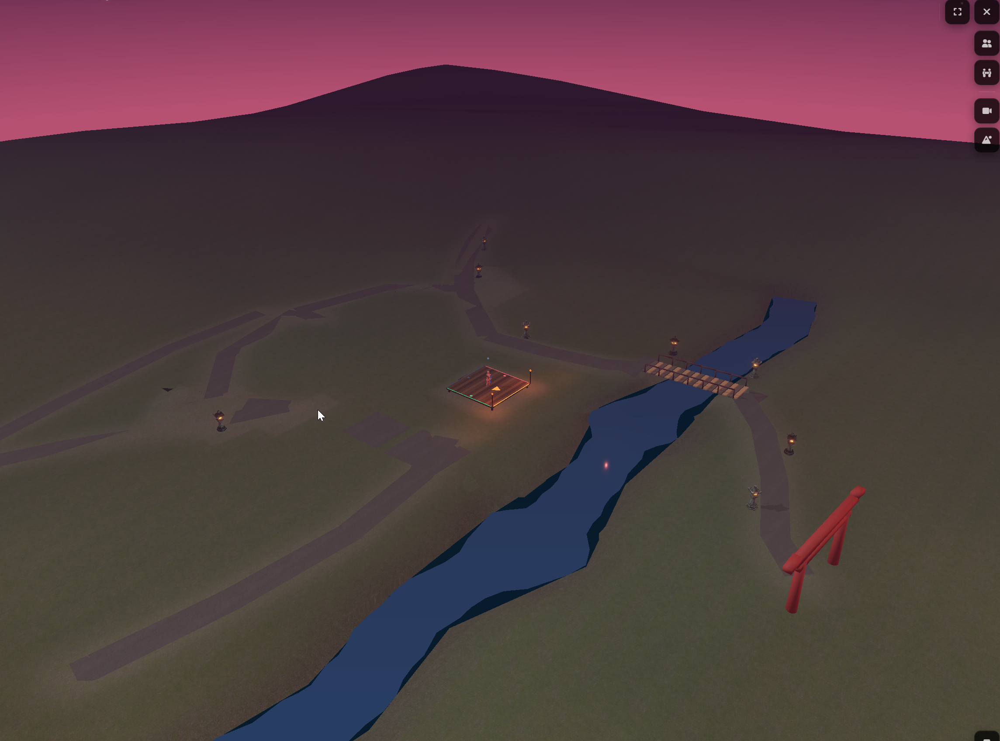

# Blossom Scene Rebuild — Handoff (2026-08-23)

## Mission

Take over the Blossom environment and rebuild it into the intimate, lush,
high-detail hanami performance garden Austen has been asking for. Forest,
Autumn, and Ocean are the visual baseline. The latest R2.1 result is rejected:
it enlarged the technical site without producing a believable place.

This handoff is specifically for an Opus continuation after the current Codex
task is archived. Start from the latest user verdict and screenshot, not from
the `approved-for-production` label still present in the R2.1 contract.

Current live review URL:

`https://localhost:5173/test/viewer-3d?scene=blossom&cam=-55.506%2C40.080%2C46.497&look=0.316%2C0.473%2C1.339&fov=50`

Latest rejected overview, preserved in commit `03eafb1997e7`:



The screenshot is the clearest description of the failure:

- The stage has become a tiny marker inside an oversized technical graybox.
- The terrain is an undifferentiated brown field, not a garden or clearing.
- The river reads as a flat, extruded blue trench rather than living water.
- Jagged path ribbons sprawl through the site without forming a persuasive
  arrival, audience experience, or garden walk.
- Sparse lanterns read as debugging dots rather than a designed procession.
- The primitive torii remains visibly low-poly and detached from the route.
- The giant dark horizon mound dominates the composition while the missing
  grove leaves no canopy, enclosure, depth, or sense of place.
- Increasing the terrain and camera envelope solved edge exposure but destroyed
  intimacy, hierarchy, and the intended moonlit hanami atmosphere.

The next move is not to decorate this field. Recompose the scene from the ground
up, with canopy masses included in the spatial design from the first review.

## Done — verified

- Commit `03eafb1997e7` preserves Austen's 2026-08-23 rejection screenshot at
  `docs/superpowers/specs/handoff-assets/2026-08-23-blossom-scene-rebuild/current-overview.png`.
  The committed file is 3,593,854 bytes and survives the temporary clipboard
  path used by the original attachment.
- No Blossom visual outcome is accepted as done. This is deliberate. The latest
  user verdict supersedes the R2.1 document's approval label, and the current
  implementation remains uncommitted in the shared checkout.

## Believed done — unverified

- The standalone `/test/viewer-3d` route appears to bypass the Composer shell,
  fake loading curtain, and workbench progress copy. Austen continued using the
  route after those complaints were addressed, but the route is uncommitted and
  should receive a focused cold-load check before it is called complete.
- Camera pose persistence appears to work through the `cam`, `look`, and `fov`
  URL parameters and the existing local camera store. The live URL above proves
  that a pose is being written, but a fresh Opus task should verify exact pose
  restoration across refresh and HMR before claiming completion.
- The responsive viewer HUD and control surfaces were exercised earlier in this
  task, but their current edits are also uncommitted. Do not conflate their
  apparent usability with acceptance of the Blossom composition.

## In flight

### Repository state

- Branch: `main`. No branch or worktree was created.
- Scene baseline before the handoff asset commit: `26b150097b40`.
- Handoff screenshot commit: `03eafb1997e7`.
- The shared index already contains staged files from unrelated live tasks.
  They were not committed or modified by this handoff. Every future commit must
  use an explicit pathspec.
- The Blossom R2.1 implementation and standalone viewer work are uncommitted.
  Audit before retaining any of it; do not assume uncommitted means disposable,
  because several useful infrastructure changes are mixed with the rejected
  composition.

Relevant modified paths:

```text
M  scripts/blender-export-blossom-full.py
M  scripts/build-blossom-environment.py
M  scripts/optimize-blossom-glb.mjs
M  src/lib/shared/3d/components/MobileSceneControls.svelte
M  src/lib/shared/3d/components/SceneSelectorPopover.svelte
M  src/lib/shared/3d/components/Viewer3DCanvas.svelte
M  src/lib/shared/3d/components/Viewer3DCamera.svelte
M  src/lib/shared/3d/components/Viewer3DFullscreen.svelte
M  src/lib/shared/3d/environments/primitives/ReflectivePool.svelte
M  src/lib/shared/3d/environments/primitives/reflective-pool-shader.ts
M  src/lib/shared/3d/environments/scenes/BlossomScene.svelte
M  src/lib/shared/3d/environments/scenes/cherry-blossom/blossom-runtime.ts
M  static/models/blossom/blossom_environment.glb
```

Relevant untracked paths:

```text
docs/superpowers/specs/blossom-masterplan-r2/
scripts/blossom-masterplan-rules.mjs
scripts/verify-blossom-composition.mjs
src/lib/shared/3d/domain/camera-url-pose.ts
src/routes/test/viewer-3d/
src/lib/shared/3d/environments/scenes/cherry-blossom/BlossomGroundDetail.svelte
src/lib/shared/3d/environments/scenes/cherry-blossom/BlossomGroundLife.svelte
src/lib/shared/3d/environments/scenes/cherry-blossom/BlossomLighting.svelte
src/lib/shared/3d/environments/scenes/cherry-blossom/BlossomRiver.svelte
src/lib/shared/3d/environments/scenes/cherry-blossom/blossom-ground.ts
src/lib/shared/3d/environments/scenes/cherry-blossom/blossom-site.ts
src/lib/shared/3d/environments/scenes/cherry-blossom/blossom-stage-operations.ts
src/lib/shared/3d/environments/scenes/cherry-blossom/blossom-water.ts
tests/unit/3d/blossom-masterplan.test.js
tests/unit/3d/blossom-production-contract.test.ts
```

### What the current R2.1 implementation does

The uncommitted R2.1 builder currently produces a site-systems phase from the
masterplan contract:

- 256 × 264 metre terrain envelope (`x -128…128`, `y -122…142`);
- a 12 × 8 metre stage and four audience zones with declared capacity 136;
- twelve public paths and two service paths;
- a 5.4 metre river with two local widenings, a surface elevation of -0.15 m,
  and a 0.85 m bed depth;
- a 4.5% bridge slope and eight lanterns;
- no PlantFactory trees, grass, petals, or ecology in the current phase; and
- an optimized 3.82 MiB `blossom_environment.glb`.

The production contract is split into pure owners:

- `blossom-site.ts`: terrain, grades, audience landform, and circulation;
- `blossom-stage-operations.ts`: stage safety, backstage, technical access,
  storage, and emergency routes;
- `blossom-water.ts`: river, pools, banks, bridge, and fish habitat bounds; and
- `blossom-ground.ts`: ground-family masks and vegetation exclusions.

`scripts/build-blossom-environment.py` consumes those values but is still a
large procedural authoring monolith. `BlossomScene.svelte` gates decorative
atmosphere until phase 5. `Viewer3DCamera.svelte` currently permits an 82 metre
Blossom orbit, which exposed the bad wider context in the supplied screenshot.

### Technical verification, not visual approval

These checks passed against the uncommitted R2.1 state on 2026-08-23:

```text
pnpm exec vitest run tests/unit/3d/blossom-masterplan.test.js \
  tests/unit/3d/blossom-production-contract.test.ts \
  --config tests/config/vitest.config.ts

2 test files passed; 15 tests passed.

node scripts/verify-blossom-composition.mjs

status: verified
asset: 3.82 MiB
audience zones: 4; declared capacity: 136
paths: 14 total; 12 public; 2 service
bridge slope: 4.5%
lanterns: 8
gated decoration nodes: 0
```

The validator proves that its own geometric contract is internally consistent.
It does not prove that the contract describes a beautiful or believable scene.
The screenshot proves the opposite. A previous TypeScript pass also found many
unrelated repository errors, so there is no workspace-wide green check to
inherit.

## Loose ends (ranked)

1. **Revoke the false approval state.** Change the R2.1 status from
   `approved-for-production` back to a rejected or redesign state before any
   further production work. Preserve the current files for comparison until a
   replacement plan is accepted; do not silently erase the evidence.
2. **Study the actual visual baselines.** Inspect Forest, Autumn, and Ocean in
   the live viewer and trace which shared terrain, grass, water, lighting, fog,
   and asset-placement owners create their quality. Reuse those owners rather
   than inventing Blossom-only substitutes.
3. **Inventory PlantFactory before laying out the grove.** The existing
   research and contact sheets are in
   `docs/superpowers/specs/blossom-plantfactory-family-r1/`. Use the full
   available family, not Meshy trees, procedural blossom blobs, or a two-tree
   composition. PlantFactory tree silhouettes must be present in the first
   spatial review because canopy scale defines the room.
4. **Produce two or three compact composition boards before code.** Each board
   should show a credible 50–80 metre garden context, stage, audience areas,
   canopy masses, arrival sequence, public garden walk, discreet service route,
   bridge, real water body, bank planting, horizon treatment, and measured
   sightlines. Include front, audience, three-quarter, and top-down views. Do
   not return to a 256 metre bare field merely to accommodate maximum orbit.
5. **Get Austen's explicit visual approval on one board.** The current task
   repeatedly failed by treating geometric validation as design approval and by
   attempting to build too many systems at once. Do not implement the next
   environment until one spatial/aesthetic direction is approved.
6. **Graybox the accepted plan with canopy volumes from day one.** Use actual
   low-LOD PlantFactory silhouettes or faithful proxies alongside terrain,
   stage, bridge, water, and audience grades. A treeless site-systems phase
   cannot answer whether the clearing is intimate, legible, or beautiful.
7. **Rebuild the hero systems to the baseline quality bar.** Water must have
   depth, banks, reflection, motion, and habitat; paths must be graded natural
   surfaces with soft edges; the torii must be a detailed architectural asset;
   audience space must feel intentional; the stage must remain the visual and
   operational focus; planted edges must hide the playable boundary.
8. **Add life only after composition approval.** Koi may be added where they
   can actually inhabit the water. Petals must originate from nearby canopy
   volumes and remain localized. Grass, roots, lanterns, paths, water, bridge
   landings, and stage clearances must never intersect.
9. **Verify aesthetically, not only mechanically.** Tour the accepted scene at
   human eye level, audience level, bridge approach, shrine approach, stage
   reverse, and deliberately wide orbit. Compare screenshots directly with
   Forest, Autumn, and Ocean. Responsive containment and green tests are the
   final verification layer, not the definition of success.
10. **Separate useful viewer infrastructure from scene revisions.** Finish and
    commit the standalone route, exact camera restore, and responsive HUD as a
    coherent concern after focused verification. Keep that work independent of
    whichever Blossom floor plan is ultimately approved.

## Decisions already made

- Blossom must reach the same visual standard as Forest, Autumn, and Ocean.
- Austen explicitly rejected simplified blob trees, low-poly trees, and Meshy
  trees for this environment. Use the PlantFactory catalog and its variants.
- The scene must be designed from a floor plan with explicit placements,
  aesthetics, circulation, and sightlines. Do not “smash everything in.”
- The garden should feel intimate and lush, not overcrowded and not empty.
- Ground must read as one continuous landscape. The pasted circular stage-floor
  island is rejected, and grass may never grow through water or hardscape.
- The tree beside the old bridge blocked access and was rejected. Bridge
  approaches and landings must remain physically clear.
- The river must read as water, not a flat blue polygon. Its banks, depth,
  reflections, planting, and fish habitat must agree.
- Audience placement and public walking routes are first-class parts of the
  environment, not labels added after the terrain is built.
- The wider clearing needs believable context and a concealed boundary. The
  ground cannot simply drop off at the camera limit.
- A detailed torii is required. The current primitive red arch is rejected.
- Global petal fall is rejected. Petals must come from nearby cherry canopies
  and should not fill empty space uniformly.
- The `/test/viewer-3d` workbench should stay independent of the full Composer
  shell, load without fake progress UI, and remember the exact camera pose
  through refresh and HMR.
- Austen's latest verdict is authoritative: the current landscape is bigger,
  but it is not what the project was going for. R2.1 is not visually approved.

## Gotchas

- Port 5173 is Austen's HTTPS/2 dev server. Use `https://localhost:5173`; never
  start, stop, restart, or kill it.
- The working tree and Git index are shared with other live tasks. Never stage,
  format, revert, or commit unrelated paths. Use explicit pathspecs for every
  commit.
- Do not create a branch or worktree unless Austen explicitly requests it in
  the new conversation.
- The R2.1 JSON currently says `approved-for-production` with
  `activeProductionPhase: 2`. That string is stale relative to the latest user
  feedback and must not be treated as permission to continue the current plan.
- `BlossomScene.svelte` rotates the authored GLB by `Math.PI`. Plan-space to
  viewer-space conversion in `blossom-site.ts` is effectively
  `[-x, elevation, depth]`; mirrored coordinates are an easy source of wrong
  bridge, river, torii, and camera placement.
- Runtime `Stage3D` replaces the authored stage, so authored stage nodes are
  hidden. Do not judge stage contact using only the Blender source.
- `BlossomGroundDetail.svelte` consumes
  `static/textures/blossom-floor/blossom-ground-family-mask.png`. The mask can
  pass contract tests while still producing visibly artificial ground.
- The current 82 metre orbit is useful for exposing boundaries, but the answer
  is a designed wider context and intentional camera policy, not a giant empty
  terrain slab.
- Blender 5.0 may print a harmless BlenderMCP unregister traceback on exit even
  when the build/export succeeds. Confirm process exit and output asset before
  treating it as a failure.
- Earlier plans remain useful research but are not current approval:
  `blossom-recomposition-r1/`, `blossom-ground-r1/`, and
  `blossom-masterplan-r2/` all describe iterations Austen later criticized.
- The masterplan validator measures declared geometry, connectivity, safety,
  and containment. It does not measure composition, intimacy, material quality,
  hierarchy, or beauty. Never use its green result as a substitute for visual
  review again.
