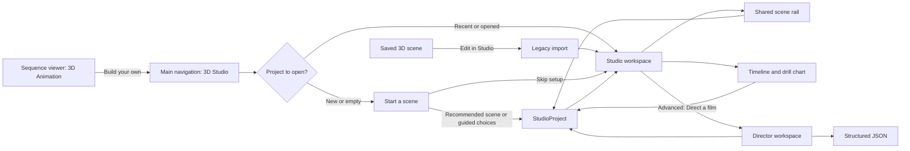

# Progressive 3D Studio

## Decision

Keep **one product destination, 3D Studio**, with progressive depth inside it.
Do not create separate beginner and expert products.

A new or empty project opens a guided **Start a scene** surface over a live
preview. It asks one contextual question at a time, supplies a useful default
for every answer, and can create a recommended scene immediately. Completing or
skipping the guide opens the existing Stage workspace with the same project
object. The shared control rail, timeline, drill chart, Director, and JSON are
progressively disclosed from there.

Director remains a distinct expert workspace because it edits a multi-scene,
document-first film and camera track. It should be entered from 3D Studio and
operate on the same project, not become a second saved format or a competing
top-level destination.

This is a product and technical design. It authorizes no production UI changes.

## Why this is the right boundary

The codebase has already answered half of the IA question:

- The shipped One Stage work deliberately replaced separate Scene and Stage
  authoring surfaces with one `3D Studio` module. Reintroducing a novice Scene
  product would restore the split that work removed.
- `SceneControlWorkspace.svelte` is the canonical responsive control owner. It
  already adapts from a compact sheet to a performer spine, rail, and inspector.
- Stage adds timed sequences and formations around that same scene control
  surface. A beginner scene can therefore graduate in place if its data is a
  real Stage project.
- Director has legitimately different editing semantics. Its source document
  is resolved into a film, synchronized with JSON, and can contain multiple
  scenes and camera tracks. That warrants a linked workspace, but not a separate
  content identity.

The product should not label people "beginner" or "expert." The meaningful
states are **start**, **edit**, and **direct**. People can move deeper when the
task calls for it.

## Evidence

### Repository evidence

| Finding | Evidence | Design consequence |
| --- | --- | --- |
| 3D already has two production entry contexts | `SequenceViewerOrchestrator.svelte` creates `Viewer3DState`; `ViewerMotionSurface.svelte` mounts `Viewer3DCanvas`, `SceneControlWorkspace`, and `Viewer3DRailHint`. `StageModule.svelte` mounts `Viewer3DFullscreen` plus choreography tools. | Discovery can link from the sequence viewer, while creation belongs in 3D Studio. |
| The precision control owner already exists | `src/lib/shared/3d/components/controls/SceneControlWorkspace.svelte` owns performer, formation, camera, scene, presets, save, and admin-only developer tools, with `MobileSceneControls` for compact hosts. | Compose it after the guided start. Do not build a second rail or a reduced clone. |
| The first-open viewer hint is informational, not generative | `Viewer3DRailHint.svelte` says "Everything is on that rail" and names Scene, Performers, and Presets. It is suppressed on compact screens. | Add a contextual route into 3D Studio, but keep the sequence viewer focused on the sequence already being viewed. |
| A guided scene builder exists but is orphaned | `Scene3DSetupGuide.svelte` asks Scene, Performers, Formation, and Presets using real owners. Production grep finds it mounted only by `/test/scene-setup-guide`; its former Scene Studio host was removed by One Stage. | Reuse its live, contextual interaction ideas. Replace its transient viewer-only state contract and do not resurrect its old host. |
| Stage onboarding starts too late | `StageFirstRun.svelte` explains Choose sequence, drill chart, and playback only after Stage has loaded. | Add creation guidance before the full workbench, then keep the current Stage teaching for the next layer. |
| Stage currently excludes solo | `stage-choreography-state.svelte.ts` clamps performer count to 2 through 8, while the viewer and Director accept 1 through 8 and Stage's formation domain includes `solo`. | Project and Stage count must become 1 through 8 before the starter can promise Solo. |
| Stage opens the complete sequence browser | `StageModule.svelte` and `StageTimeline.svelte` open `SequencePickerModal`, which is the shared Browse workspace. | The starter must use a curated sequence reference. "Browse all" remains an explicit escape hatch. |
| The environment and prop catalogs are intentionally broad | `scene-environment.ts` defines ten environments. `scene-prop-catalog.ts` defines fourteen visible prop families, plus variants and build options. `PerformerHubDetail.svelte` adds Avatar, Sequence, Prop, Planes, Effort, and Effects tabs. | Show three recommended choices at a time and put the complete canonical pickers behind "More." |
| Formations are already count-aware | `FormationPopover.svelte` derives disabled presets from `PRESET_VALID_COUNTS`; Stage additionally owns `side-by-side`, `facing-each-other`, `back-to-back`, `line`, `circle`, `v-shape`, and other generated sets. | The starter can present plain-language, count-valid shape choices without inventing geometry. |
| Current persistence is split | `Viewer3DPersistConfig` serializes a live viewer look; `Scene3DSnapshot` adds features, props, and optional sequence steps; `StageChoreography` owns performer sequence lanes and timed formations; `FilmDirectorInput` owns authored film direction. | A common versioned Studio project must be established before guided creation ships. Runtime snapshots cannot be the project model. |
| Saved-scene handoff loses structure | `open-3d-scene.ts` writes one `SceneStudioHandoff` containing one sequence and BPM, while the look is applied through current settings. It does not carry Stage formations, per-performer lanes, or a film document. | Replace the handoff with project import and explicit legacy migration. |
| Director already has the right expert editing pattern | `film-director-state.svelte.ts` keeps `sourceInput`, resolved `film`, and synchronized JSON. `FilmDirectorScene.svelte` sends precise performer edits back through `onPerformerEdit`. | Preserve document-first resolution and JSON as an advanced surface. Adapt it to the Studio project rather than copying its controls. |

### Runtime evidence, 2026-08-27

The persistent signed-in debug profile was inspected in a task-owned Chrome
tab against `https://localhost:5173`.

- `/stage/scene` exposed 67 visible interactive targets in the sampled desktop
  state: app navigation, three performer chips, scene rail, transport, timeline,
  and drill-chart controls. This is a capable editing surface, not a calm first
  decision.
- `/browse/gallery` normalized to `/browse/explore/sequences` and, after data
  settled, offered **1,499 sequences**, three large browse doors, ten additional
  browse strategies, and 26 visible interactive targets. The gallery is doing
  its power-browsing job; it should not be the default cost of starting a 3D
  scene.
- `/test/film-director` presented a comparatively calm marquee with seven film
  starting points.
- `/test/film-director?film=star` remained at "Preparing the first scene" for
  more than 50 seconds in the sampled run, with no console error or warning.
  This does not establish a root cause, but it is enough to require a bounded
  loading state, retry, and production hardening before Director becomes a
  promoted creation path.

### External interaction guidance

The recommendation also follows current platform guidance:

- [Apple's onboarding guidance](https://developer.apple.com/design/human-interface-guidelines/onboarding)
  says onboarding should be fast, interactive, and optional, and that
  instructions about a control should appear near it.
- [W3C cognitive accessibility guidance](https://www.w3.org/WAI/WCAG2/supplemental/)
  calls for making the most important tasks and actions easy to find, using
  clear words, and keeping content succinct.

Those principles fit the repository evidence: teach by changing the real live
scene, keep a default ready, and disclose precision where it becomes relevant.

## Information architecture



### Destination: 3D Studio

Keep the existing module name and navigation placement.

The destination has three internal presentation states:

1. **Start a scene**: a transient guided composer for a new project.
2. **Studio workspace**: the current Stage canvas, shared scene rail, playback,
   timeline, and drill chart.
3. **Director workspace**: an advanced, capability-gated film editor opened
   from the Studio workspace. It may use a deep-linkable route state, but it
   stays under the 3D Studio destination and project identity.

Do not add Beginner/Expert tabs. Do not make users choose a mode before they
know what either mode means.

### Entry points

| Entry | Behavior |
| --- | --- |
| Main navigation, 3D Studio | Open the most recent project when one exists. Otherwise open Start a scene. Include New scene and Open project in the project menu. |
| Sequence viewer, first 3D use | Keep `Viewer3DRailHint`. Add a secondary "Build your own in 3D Studio" action after the user sees the current sequence animate. Carry that sequence as the starter movement if selected. |
| Saved 3D scene collection | Replace the current one-shot handoff with legacy import into a Studio project, then open the workspace. |
| Director marquee | Once production-ready, expose "Direct a film" under the Studio project's Advanced actions. Keep the seven-film marquee as Director's own starting surface. |
| Structured JSON | Offer inside Director and under an Advanced project action. Never show it during guided start. |

## Primary flow: first delightful scene

### Entry state

The live preview is already populated with the recommended project. The primary
action, **Create this scene**, is enabled immediately. A user can get a result
with zero configuration.

Secondary actions:

- **Make a few choices** enters the guided questions.
- **Skip setup and edit details** opens the full workspace with the same
  recommended project.

No sequence gallery is loaded or shown.

### Guided questions

Ask one question at a time. Every step has one selected default, three visible
answers at most, a live preview, Back, and Continue. "More" opens the canonical
complete picker for that axis without changing the default flow.

1. **Who's on stage?**
   - Solo, one performer
   - Duo, two performers (recommended default)
   - Ensemble, four performers
   - More can expose an exact count from 1 through 8.
2. **Where are they performing?**
   - Three curated environments such as Cosmic, Forest, and Ocean
   - More scenes opens the existing `SceneSelectorPopover` catalog of ten.
3. **What are they holding?**
   - Three curated answers such as Poi, Staff, and Bare hands
   - More props opens the existing `ScenePropPicker` with all families and
     builds.
4. **How should they stand?** This step is skipped for Solo.
   - Duo: Side by side, Face each other, Back to back
   - Ensemble: Line, Circle, V shape
   - More formations opens the count-filtered canonical selector and the drill
     chart for exact placement.

Changing Who revalidates the shape. If the old shape is invalid, choose the
recommended valid shape and explain the change in one sentence. Never leave the
preview in an impossible configuration.

Movement is not a required first-run question. The recommended recipe includes
a stable, loopable sequence reference. After creation, a **Change movement**
quick action can show a small set of curated alternatives, with **Browse all
sequences** as the explicit route into `SequencePickerModal`.

### Completion

Create the project atomically, preserve the current preview, and reveal the
normal workspace without a reload or camera jump.

Show a compact result summary:

> Duo · Cosmic · Poi · Face each other

Then offer three contextual next actions:

- Change movement
- Edit details
- Add a formation change

The existing `StageFirstRun` guidance can teach the timeline after this point.
It should not compete with the starter during the same moment.

## Progressive capability disclosure

| Depth | Visible capability | What stays hidden |
| --- | --- | --- |
| Start | One question, three recommended answers, live preview, immediate Create | Gallery, full catalogs, timeline, camera numerics, effect parameters, JSON |
| Result | Play, summary, three contextual next actions, undo | Full rail remains available but unopened |
| Edit details | Existing performer, formation, camera, scene, and preset rail | Developer tools remain role-gated; JSON stays under Advanced |
| Choreograph | Existing timeline, per-performer sequence lanes, drill chart, exact set timing and positions | Director document mechanics |
| Direct | Multi-scene film, free-form direction, camera track, film save/restore | JSON remains an opt-in panel |
| Structured | Validated synchronized JSON with error location and last-good preview | Nothing is removed; the visual controls remain available |

The escape hatches are always discoverable through plain actions, not prior
knowledge of internal terms:

- "More scenes"
- "More props"
- "Place performers exactly"
- "Edit every detail"
- "Direct a film"
- "Edit project JSON"

## Beginner guardrails

1. **A good default is always selected.** There is no blank canvas and no
   mandatory setup form.
2. **One question at a time.** Never put the ten environments, fourteen prop
   families, formation catalog, six performer tabs, and sequence gallery on the
   same first-run surface.
3. **Use words people already know.** Say Who, Place, Prop, and Shape. Introduce
   Stage terms such as set, clip, and transition only when the matching control
   appears.
4. **Skip irrelevant decisions.** Solo skips formation. Unsupported formations
   never appear as selectable answers.
5. **Teach with the real preview.** Every answer updates the live scene. The
   preview is the explanation.
6. **Make escape safe.** Skip setup creates the current recommended project;
   Back preserves prior answers; closing the guide retains a draft during the
   session.
7. **Keep browsing optional.** Do not mount or fetch the full gallery until the
   user selects Browse all.
8. **Bound every load.** Environment, avatar, sequence, and Director loads need
   visible progress, a timeout or failure state, Retry, and a route back to the
   last good project.
9. **Never fork the data.** A starter choice is a project edit with undo, not a
   disposable tutorial state.
10. **Respect compact screens.** The guide becomes a bottom sheet over the live
    preview and retains 44px targets. Essential labels never become icon-only.

## Common project specification

### Current gap

There is no common saved scene specification today:

- `Viewer3DPersistConfig` is a runtime look snapshot.
- `Scene3DSnapshot` captures a saved look and optional sequence steps, but not
  per-performer lanes or timed sets.
- `StageChoreography` owns timed formation sets and sequence clips, but not
  avatar, prop, effort, effects, planes, camera shots, or persistence.
- `FilmDirectorInput` owns authored directives, multiple scenes, blocking, and
  camera, but it does not represent Stage's complete clip-lane model.

None should silently become the universal model. Introduce one versioned
aggregate and adapt the existing owners to it.

### Proposed normalized model

Names are illustrative; schema review is part of implementation Phase 0.

```ts
interface StudioProjectV1 {
  schema: "tka.studio-project";
  version: 1;
  id: string;
  revision: number;
  name: string;
  activeSceneId: string;
  scenes: StudioSceneV1[];
  starter?: {
    recipeId: string;
    completedAt?: string;
  };
  directorSource?: {
    input: FilmDirectorInput;
    basedOnRevision: number;
  };
  provenance?: {
    importedFrom?: "scene-3d" | "stage" | "film-director";
    warnings?: string[];
  };
}

interface StudioSceneV1 {
  id: string;
  name: string;
  timing: {
    bpm: number;
    durationBeats: number;
  };
  location: {
    environmentId: SceneEnvironmentId;
    sceneFeatures: Record<string, boolean>;
    oceanVariant?: string;
    showStage?: boolean;
    showAudience?: boolean;
  };
  cast: StudioPerformerV1[];
  staging: {
    stageWidth: number;
    stageDepth: number;
    sets: StudioFormationSetV1[];
  };
  camera: {
    viewerPose: CameraConfig;
    shots?: DirectorCameraTrackV1[];
  };
  presentation: {
    visiblePlanes: Plane[];
    showGridLabels: boolean;
    effectToggles: EffectToggles;
  };
}

interface StudioPerformerV1 {
  id: string;
  label: string;
  avatarId: AvatarId;
  prop: PropType;
  propBuild?: PropBuild;
  staffLengthCm?: number;
  effort: EffortId;
  effects: PerformerEffectsV1;
  planes: PerformerPlanesV1;
  sequenceClips: StageSequenceClip[];
}

interface StudioFormationSetV1 {
  id: string;
  label?: string;
  atBeat: number;
  transitionBeats: number;
  presetId?: FormationPresetId;
  spots: Record<string, FormationSpot>;
}
```

### Ownership rules

- `StudioProjectV1` is the only saved content identity.
- `Viewer3DState` remains runtime render state. `toViewerSeed(project, scene,
  beat)` and live project commands project into it.
- `StageChoreography` becomes a compatibility adapter for the performance and
  staging portion until Stage reads the project directly.
- `FilmDirectorInput` remains the Director's authored language. Resolving it
  updates normalized project scenes. Store the source alongside the project so
  free-form intent and JSON are not discarded.
- If a precise Studio edit replaces a Director directive, patch that axis to a
  literal value and tell the user "This value is now exact." Do not retain a
  stale random directive behind a different visible result.
- Project UI state, open panels, selected inspector tabs, and guide step do not
  belong in the saved model.

### Starter recipes

Create one owner for atomic project construction:

```ts
interface StarterRecipe {
  id: string;
  title: string;
  sequenceRef: StableSequenceRef;
  cameraPreset: string;
  defaultEnvironmentId: SceneEnvironmentId;
  defaultProp: PropType;
  castDefaults: Record<"solo" | "duo" | "ensemble", {
    count: number;
    formationPreset: FormationPresetId;
  }>;
}

function createStudioProjectFromRecipe(
  recipe: StarterRecipe,
  choices: StarterChoices
): StudioProjectV1;
```

The recipe owns a stable sequence reference and known-good camera, not a query
against the full gallery. The constructor validates count, formation, assets,
and sequence compatibility before one project commit. The starter UI never
assembles partial viewer state itself.

### Legacy migration

| Source | Migration |
| --- | --- |
| `Collected3DScene` | Create one scene and one performer clip from `steps` when present. Convert current look fields. Where old snapshots did not preserve an avatar or stable performer identity, use the current default and record a non-blocking provenance warning. |
| Current Stage session/document | Copy BPM, environment, cast ids, per-performer clips, stage dimensions, and formation sets. Fill look fields from the live viewer once, then persist them with the project. |
| Stored Director film | Preserve `FilmDirectorInput` under `directorSource`, resolve it, and translate resolved scenes into normalized scenes. Keep resolver errors attached to the source instead of creating a partial project. |

## Exact reuse and change points

### Reuse unchanged

| Owner | Use |
| --- | --- |
| `src/lib/shared/3d/components/Viewer3DFullscreen.svelte` | Live preview and normal Stage rendering host |
| `src/lib/shared/3d/components/controls/SceneControlWorkspace.svelte` | Canonical precise controls after the starter |
| `src/lib/shared/3d/components/SceneSelectorPopover.svelte` | Complete environment picker behind More scenes |
| `src/lib/shared/3d/components/controls/ScenePropPicker.svelte` | Complete prop and build picker behind More props |
| `src/lib/shared/3d/components/controls/FormationPopover.svelte` and `FormationSelector.svelte` | Count-valid complete formation catalog |
| `src/lib/shared/3d/components/controls/PerformerHubDetail.svelte` | Exact avatar, sequence, prop, planes, effort, and effects editing |
| `src/lib/shared/components/sequence-picker/SequencePickerModal.svelte` | Explicit Browse all sequences escape hatch only |
| `src/lib/features/stage/components/StageTimeline.svelte`, `FormationOverlay.svelte`, and `src/lib/features/stage/state/formation-presets.ts` | Timed sets, exact placement, and travel |
| `src/routes/test/film-director/_lib/film-director-state.svelte.ts`, `resolve-film-director-spec.ts`, `director-viewer-adapter.ts`, and `_components/FilmDirectorJsonEditor.svelte` | Director document-first edit and validated structured input |
| `src/lib/features/scene-3d-collection/state/scene-3d-collection-state.svelte.ts` and `components/Scene3DPreview.svelte` | Legacy collection browsing and import source |

### Extend

| Area | Change |
| --- | --- |
| `src/lib/features/stage/domain/stage-types.ts` and `stage-choreography-state.svelte.ts` | Allow one performer and adapt Stage to the project model |
| `src/lib/features/stage/StageModule.svelte` | Host the new-project starter, project load/save, and advanced entry actions |
| `src/lib/shared/3d/components/onboarding/Viewer3DRailHint.svelte` | Add a contextual Build your own action without turning the sequence viewer into a setup wizard |
| `src/lib/features/scene-3d-collection/services/open-3d-scene.ts` | Replace the session-only handoff with legacy project import |
| Director route/components | Move behind the 3D Studio capability boundary, accept a project, add bounded loading/error/retry |

### Create

Suggested ownership, subject to Phase 0 naming review:

- `src/lib/features/stage/project/studio-project-schema.ts`
- `src/lib/features/stage/project/studio-project-migrations.ts`
- `src/lib/features/stage/project/studio-project-adapters.ts`
- `src/lib/features/stage/project/starter-recipes.ts`
- `src/lib/features/stage/project/create-studio-project-from-recipe.ts`
- `src/lib/features/stage/components/StudioStarter.svelte`
- `src/lib/features/stage/components/StudioProjectSummary.svelte`

Do not create a parallel scene rail, environment catalog, prop catalog,
formation engine, gallery, renderer, or Director resolver.

## Staged implementation plan

### Phase 0: Contract and proof

1. Finalize and validate `StudioProjectV1` with Zod.
2. Write round-trip adapters for the current Stage state, viewer seed, one saved
   scene, and one Director film.
3. Prove Solo through the existing Stage and viewer adapters.
4. Register three starter recipes using stable, locally testable sequence
   references.
5. Decide persistence location and ownership by tracing the current saved
   collection path. Do not add a second save subsystem.

Exit: a literal starter project, an existing Stage scene, a saved 3D scene, and
a Director document all validate or fail with a named migration error.

### Phase 1: Guided start vertical slice

1. Mount `StudioStarter` for a new project inside `StageModule`.
2. Implement Who, Place, Prop, and contextual Shape using the recipe constructor
   and existing full pickers behind More.
3. Keep a live preview and preserve it when revealing the normal workspace.
4. Add Create recommended scene and Skip setup paths.
5. Defer the complete sequence gallery until Browse all is selected.

Exit: Solo, Duo, and four-person Ensemble each produce a playable, editable
`StudioProjectV1` without visiting the gallery.

### Phase 2: Persistence and graduation

1. Save and reopen projects.
2. Adapt Stage timeline and scene rail edits to project commands with undo.
3. Migrate saved 3D scenes and remove the one-shot session handoff.
4. Add the post-create summary and contextual next actions.
5. Add the sequence-viewer discovery link.

Exit: a starter project survives reload, reopens in the full workspace, and
round-trips exact performer, prop, environment, sequence, and formation edits.

### Phase 3: Director integration

1. Production-harden Director loading and errors.
2. Enter Director from a Studio project and preserve `sourceInput` alongside the
   normalized project.
3. Define literal patch behavior when rail edits replace directives.
4. Keep JSON synchronized with the Director source and preserve the last good
   rendered project on validation failure.
5. Migrate stored films.

Exit: a starter scene can become a multi-scene film, return to Studio, and save
without losing either the rendered project or authored Director source.

### Phase 4: Measure and refine

Instrument the funnel through the existing viewer-control analytics seam:

- 3D Studio discovered from navigation or sequence viewer
- recommended scene created
- guided step entered/completed/skipped
- More picker opened
- gallery opened
- first play
- first detail edit
- first formation change
- Director opened
- project saved/reopened
- load failure/retry

Review real session friction before changing the number or order of choices.

## Risks and mitigations

| Risk | Mitigation |
| --- | --- |
| A fourth scene format makes the split worse | Make the project schema the saved identity and define adapter authority before UI work. |
| Starter defaults become stale or reference missing sequences | Validate recipes in tests and resolve stable references at build/test time. Show a retryable project error, not a surprise gallery. |
| Live preview reloads or jumps when the guide completes | Keep one viewer instance and apply one atomic project commit. Assert camera and playhead continuity. |
| Solo works in viewer but fails in Stage | Change Stage's clamp to 1 through 8 and add adapter/runtime tests before exposing Solo. |
| "More" recreates the control wall | Open one canonical picker for the current question, then return to the guide summary. Never expose all pickers together. |
| Director source and visual edits diverge | Patch source literals or mark the exact axis as replaced; keep revision tracking and last-good resolution. |
| Director load hangs | Add named loading phases, timeout, Retry, diagnostic logging, and return to last good project before promotion. |
| Compact layout hides discoverability | Use a labeled bottom sheet, visible summary, and a text action for Edit details. Do not rely on the rail hint, which is currently compact-suppressed. |

## Acceptance criteria

### Discovery and first creation

- A first-time eligible user can find 3D Studio from main navigation without
  opening Browse or knowing a sequence name.
- First use presents a playable recommended scene with one primary Create
  action and an optional guided path.
- The guided path asks no more than four questions, shows no more than three
  primary answers per question, and always has a selected default.
- Solo, Duo, and Ensemble are all supported. Solo never asks for formation.
- The complete sequence gallery is neither mounted nor fetched until Browse all
  is explicitly selected.
- Every choice updates the live preview or reports a retryable load failure. No
  choice silently does nothing.

### Graduation and expert control

- Completing, skipping, or reopening the starter yields the same
  `StudioProjectV1` consumed by the full workspace.
- Opening Edit details preserves scene, camera, playhead, and project revision.
- Existing shared controls can edit exact environment, performer count,
  formation, position, avatar, prop/build, sequence, planes, effort, effects,
  camera, and presets.
- Timeline and drill-chart edits persist as project sequence clips and timed
  formation sets.
- Undo crosses the starter-to-workspace boundary for the most recent project
  edit.
- A saved project round-trips with no loss across reload.

### Director and JSON

- Director is not promoted from the beginner surface until its initial scene
  load has bounded progress, a failure state, Retry, and a route back.
- Director can open a Studio project, add scenes/camera direction, and save back
  to the same project id.
- JSON validation names the failing path and preserves the last good preview.
- A visual rail edit of a directive-controlled axis either patches the source
  literal or visibly explains that the axis is now exact.
- Structured input is optional and never required to access precise visual
  controls.

### Accessibility and responsive behavior

- All starter choices are buttons or radios with visible labels, selected
  state, keyboard operation, and at least 44px targets.
- Focus moves to the new question heading and returns predictably from More
  pickers.
- Motion respects reduced-motion settings; preview changes remain legible
  without animation.
- The guide remains usable at 375px, 960x412, tablet, 1440x900, 1920x1080,
  2560x1440, and 3840x2160 without clipped actions or hidden essential text.

### Technical verification

- Schema, migration, recipe, count/formation compatibility, and adapter
  round-trip tests are green.
- Browser verification proves one full path each for Solo, Duo, Ensemble,
  legacy scene import, exact Stage edit, save/reopen, Director entry, invalid
  JSON, and a forced asset/load failure.
- Runtime evidence includes screenshots at the required viewports, console
  output, and project JSON before and after expert edits.

## Open implementation decisions

These do not change the IA recommendation, but must be resolved in Phase 0:

1. Which existing persistence owner should store `StudioProjectV1` after tracing
   the current saved-collection Firestore path and access rules.
2. The three curated recipe sequence references and camera presets, verified in
   production rendering rather than selected from metadata alone.
3. Whether Director becomes a deep-linkable internal route or a workspace state
   inside `StageModule`. Either way, it remains under 3D Studio and the same
   project id.
4. The exact copy for Ensemble and formation choices after a short usability
   pass with someone who does not know Stage terminology.

These are implementation inputs, not reasons to split the product or postpone
the common project model.
