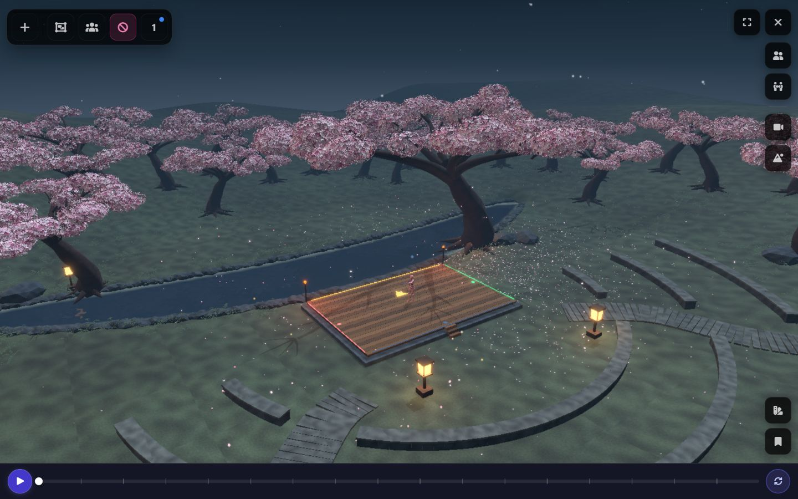
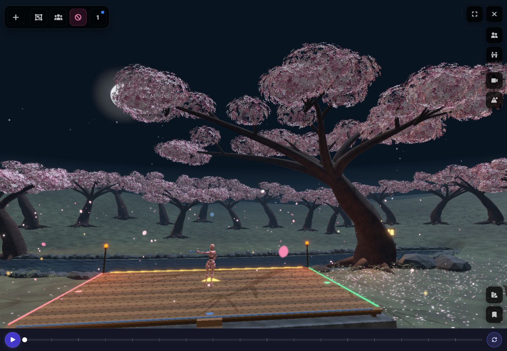
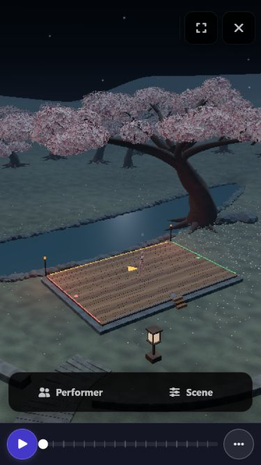

# Moonlit Blossom amphitheatre

**Rejected by Austen on September 5, 2026 (5/10).** Trees appeared planted in the water and the stage looked unrelated to the landscape. This document and its evidence are historical; the replacement is tracked in `../blossom-lantern-garden/`.

Austen authorized a complete redesign on September 5, 2026. The active scene now uses a new Blender composition: one ancient flowering cherry beside a crescent pond, a 12 × 8 m performance deck, three interrupted stone seating terraces, two curving approaches, eight washi lanterns, planted banks and a surrounding cherry grove.

The source is original procedural mesh work: tapered Bezier limbs with flowering side forks, individual five-petal florets, welded bark normals, varied stone meshes and packed procedural surface textures. Distant trees share three GPU-instanced forms. Runtime lighting combines cool moonlight with warm practical lights; existing water, stage and motion-quality infrastructure remains in use.

Visual acceptance is **pending Austen's review**. Technical checks do not award a design score.

## Source and reproduction

- Builder: `scripts/build-blossom-amphitheatre.py`.
- Editable local Blender source: `blender/blossom/moonlit-amphitheatre.blend` (generated and ignored by Git).
- Active geometry/camera/water contract: `static/models/blossom/amphitheatre-plan.json`.
- Delivered asset: `static/models/blossom/blossom_environment.glb`.
- Old hanami builders and R2 evidence remain historical; they are not the active composition.

From the repository root in PowerShell:

```powershell
$env:BLOSSOM_SKIP_RENDER='1'
& 'C:/Program Files/Blender Foundation/Blender 5.0/blender.exe' --background --factory-startup --threads 6 --python scripts/build-blossom-amphitheatre.py
node scripts/optimize-blossom-glb.mjs
& 'C:/Program Files/Blender Foundation/Blender 5.0/blender.exe' --background --factory-startup --threads 6 --python scripts/verify-blossom-amphitheatre.py
node scripts/verify-blossom-composition.mjs
```

Omit `BLOSSOM_SKIP_RENDER` to produce an additional Cycles review render. Browser captures below show the delivered runtime, whose lighting differs from the Blender review rig. `blender-export-blossom-full.py` re-exports edits made to the saved Blender source.

## Evidence

- 31 focused tests passed across runtime ownership/disposal, stage and operations contracts, pond coordinate conversion and bounds, and ground quality tiers.
- ESLint passed for all eight changed runtime TypeScript files.
- Export: **27.02 MiB**, **4,172,730** authored triangles excluding the hidden stage proxy, 50 trees and eight lanterns. Meshopt, WebP and GPU instancing are present. The runtime renders additional passes and functional stage geometry.
- Blender vertex checks passed on 107 relevant meshes: deck top 0.55 m, protected performance volume clear, and both routes clear between 0.25 m and 2.4 m above walking grade. Maximum route grades are 4.70%. This samples vertices and route stations; it is not collision or accessibility certification.
- Audience capacity 48 is a design target, not a validated seating count.
- Direct browser review used seven CSS viewport tiers from 375 × 667 through 3840 × 2160. The 4K native capture clips some application controls; canvas dimensions were separately confirmed. Phone, landscape, tablet and desktop views retain the stage and central tree.
- Reduced motion and two reported hardware threads were emulated at 375 × 667. The baked-water fallback loaded and drifting effects stopped. This is desktop emulation, not physical-device testing.
- The settled 1440 × 900 desktop view reported roughly 42–44 FPS, P95 29–31 ms and GPU95 6–8 ms while other development tasks were running. Resize snapshots in the JSON are not independent per-device benchmarks. An intermittent Svelte proxy-equality warning appeared during navigation; no scene-load or WebGL errors were observed in the reviewed views.
- The initial default Vitest command also discovered another task's incomplete nested worktree. Re-running with `--exclude '.claude/**'` isolated the five intended suites and passed.

See [technical validation](evidence/technical-validation.json), [geometry audit](evidence/geometry-validation.json) and [viewport observations](evidence/viewport-observations.json).






